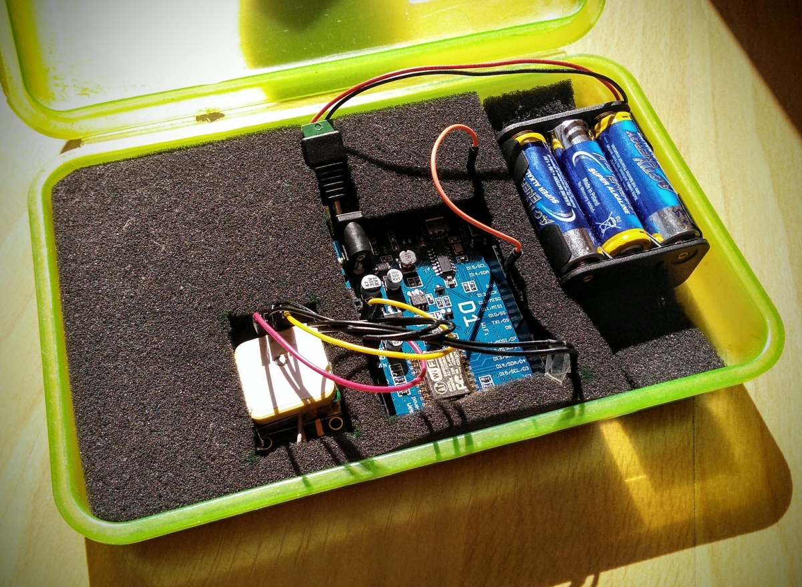

# mobile-sensebox

This is a modular (but probably overcomplicated) sketch for a mobile sensebox, written as a part of my bachelors thesis.
It measures arbitrary phenomena (currently only implemented: WiFi network count),
which are geocoded and uploaded to the [openSenseMap](https://opensensemap.org) upon wifi connection.

Supports debug logging via telnet on it's own access point + the connected network.

## hardware setup
Written for a ESP8266 ([Wemos D1 R1](http://www.wemos.cc/Products/d1.html)) with a connected GPS Module (NEO-7M),
and based on the [ESP8266 Arduino core](https://github.com/esp8266/Arduino) for Arduino IDE.
The sketch should work with any other ESP variant as well.

The GPS module must provide NMEA sentences & be connected via the hardware serial (Wemos Pins `0` & `1`).
`SoftSerial` did not work for me but created many issues (random crashes, due to buffer overflows?).

## software installation
- install [Arduino IDE](https://arduino.cc/en/Main/Software)
- install [ESP8266 Arduino core](https://github.com/esp8266/Arduino#installing-with-boards-manager)
- connect your ESP8266 via USB
- open the file `mobile-sensebox.ino` in Arduino IDE
- change the configuration to your needs in the file `config.h`
- select the board `Wemos D1 (retired)` (or whatever you have)
- hit upload (the GPS device must not be connected!)

## program behaviour
Once started, the device will idle until a first GPS fix was established.
From then on the following procedure runs repeatedly:

1. **measure** phenomena (wifi scan takes ~1sec)
2. update GPS **location** (takes 0.5-2sec)
3. **store** measurements to local filesystem (SPIFFS)
4. check if internet connection is available & **upload** stored measurements to openSenseMap
5. **idle** until the box moved a given distance and/or a time interval has passed (depends on config, default 25m, 12sec)

Two **hardware switches** are implemented, which enable/disable the measurement- and/or upload-procedure:
By default, connecting pin `15` to `GND` disables the upload,
connecting pin `14` to `GND` disables the measurements.
This can be useful for quickly uploading accumulated stored measurements!

## debug logging
A telnet logger is enabled by default, and provides basic debug output.

You can connect to it both from the created accesspoint (which is there only for this purpose), as well as on the connected wifi network.
So you either..
- connect to the open network `mobile-sensebox` and run `telnet 192.168.1.1`
- connect to the same network as configured in `config.h` and run `telnet <whateverIPtheESPgets>`

Connections are not polled all the time, so you may have to wait a moment until you receive first data.

Note that, due to the limited single-channel hardware of the ESP8266,
a reconnection to the configured WiFi network fails,
when a client is connected to the telnet logger on the open access point.

## dev environment
Developed using ESP8266 Arduino core v2.3.0 in Arduino IDE v1.6.8.

Depends on the following libraries, of which copies are stored in the `lib/` directory:
- [`Time.h`](https://github.com/PaulStoffregen/Time) for easy extraction of current timestamps
- [`TinyGPS++.h`](http://arduiniana.org/libraries/tinygpsplus/) for NMEA parsing & distance calculation
- [`ESP8266TrueRandom`](https://github.com/marvinroger/ESP8266TrueRandom) for UUID generation

## further resources
- quite helpful [ESP8266 Arduino documentation](https://github.com/esp8266/Arduino/blob/master/doc/reference.md)
- [NEO-7M datasheet](https://www.u-blox.com/sites/default/files/products/documents/NEO-7_DataSheet_(UBX-13003830).pdf)

## license
GPL-3.0
